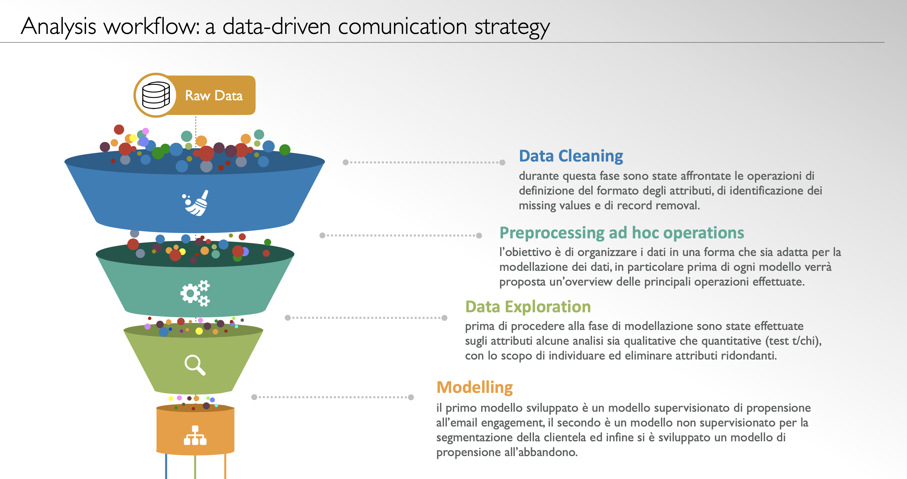

# Digital-Marketing-Analysis
We propose a data-driven communication strategy developing:

 - Email Engagement Model
 - Customers Cluster Analysis
 - Churn Prediction
 
This project is developed in R Language and could be used as model for data-driven actions. 

